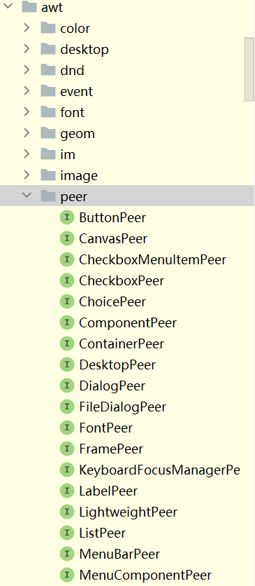

# Java Swing 源码分析

## Java 版本

Java 17

## Java Swing 文档

https://docs.oracle.com/javase/tutorial/uiswing/index.html

## Swing API 18个公共包

The Swing API is powerful, flexible — and immense. The Swing API has 18 public packages:

+ javax.accessibility	
+ javax.swing.plaf	
+ javax.swing.text
+ javax.swing	javax.swing.plaf.basic	
+ javax.swing.text.html
+ javax.swing.border	
+ javax.swing.plaf.metal	
+ javax.swing.text.html.parser
+ javax.swing.colorchooser	
+ javax.swing.plaf.multi	javax.swing.text.rtf
+ javax.swing.event	
+ javax.swing.plaf.synth	
+ javax.swing.tree
+ javax.swing.filechooser	
+ javax.swing.table	
+ javax.swing.undo

## java.awt.peer包下的XxxPeer

peer 同龄人；同辈；同等社会地位（或能力）的人

peer 对等设计模式



AWT Java 1.x 内置的库，使用的技术是对等设计模式 Peer

该设计模式将awt控件直接对应到运行平台上的一个类似或等同控件。例如Button类对应Windows的标准Button。

对等模式用于在两个控件间建立一个相互作用的关系。

AWT首先经过通用的Java技术来控制图形、事件等，然后Java虚拟机再将请求传送到具体的平台图形和控件接口去交互。

对等模式，SWT必须使用操作系统图形接口功能的交集，为了保证移植性，只能使用所有系统都支持的特性，所以AWT功能较少，图形难看，这是为了保证移植性而做出的牺牲。

Swing Java 1.2 

Swing一些底层类使用AWT的Component、Container、Window等类，可能是为了保持与AWT兼容，方便大家将代码移植到Swing上

Swing不再沿用Peer对等模式来实现GUI界面，完全基于Java自绘制图形实现。Swing界面和Windows界面不再有任何类似，尤其是窗口控件样式，但可以通过换肤来达到模拟Windows界面的效果。

Swing的结构庞大而且复杂，模式和结构会相对比较难理解，应为很多类会继承自AWT相关的类。

Swing控件都是利用Java图形功能绘制出来，而不是对应到平台的一个具体控件实现，所有Swing控件都是直接或间接用Graphics绘制出来，好处是，想要什么控件，直接绘制。这样做可以不牺牲移植性的基础上，加入丰富的界面交互功能。

缺点效率低。

1. Swing类层次太深，一个JFrame经过4、5层类继承关系，再加上虚拟机的图形功能内部实现，大概6曾转接关系；

    ```
    java.lang.Object
     java.awt.Component
      java.awt.Container
       java.awt.Window
        java.awt.Frame
         javax.swing.JFrame
    ```
   
2. Swing基于自绘制技术，为了保持可移植性，可能无法使用硬件加速和平台特性来加快图形操作的速度。Java是“高层”的图形技术，没有底层做图形速度快。