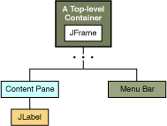

# Java Swing 源码分析

## Java 版本

Java 17

## Java Swing 文档

https://docs.oracle.com/javase/tutorial/uiswing/index.html

## Swing API 18个公共包

The Swing API is powerful, flexible — and immense. The Swing API has 18 public packages:

+ javax.accessibility	
+ javax.swing.plaf	
+ javax.swing.text
+ javax.swing	javax.swing.plaf.basic	
+ javax.swing.text.html
+ javax.swing.border	
+ javax.swing.plaf.metal	
+ javax.swing.text.html.parser
+ javax.swing.colorchooser	
+ javax.swing.plaf.multi	javax.swing.text.rtf
+ javax.swing.event	
+ javax.swing.plaf.synth	
+ javax.swing.tree
+ javax.swing.filechooser	
+ javax.swing.table	
+ javax.swing.undo

## java.awt.peer包下的XxxPeer

peer 同龄人；同辈；同等社会地位（或能力）的人

peer 对等设计模式


AWT Java 1.x 内置的库，使用的技术是对等设计模式 Peer

该设计模式将awt控件直接对应到运行平台上的一个类似或等同控件。例如Button类对应Windows的标准Button。

对等模式用于在两个控件间建立一个相互作用的关系。

AWT首先经过通用的Java技术来控制图形、事件等，然后Java虚拟机再将请求传送到具体的平台图形和控件接口去交互。

对等模式，SWT必须使用操作系统图形接口功能的交集，为了保证移植性，只能使用所有系统都支持的特性，所以AWT功能较少，图形难看，这是为了保证移植性而做出的牺牲。

Swing Java 1.2 

Swing一些底层类使用AWT的Component、Container、Window等类，可能是为了保持与AWT兼容，方便大家将代码移植到Swing上

Swing不再沿用Peer对等模式来实现GUI界面，完全基于Java自绘制图形实现。Swing界面和Windows界面不再有任何类似，尤其是窗口控件样式，但可以通过换肤来达到模拟Windows界面的效果。

Swing的结构庞大而且复杂，模式和结构会相对比较难理解，应为很多类会继承自AWT相关的类。

Swing控件都是利用Java图形功能绘制出来，而不是对应到平台的一个具体控件实现，所有Swing控件都是直接或间接用Graphics绘制出来，好处是，想要什么控件，直接绘制。这样做可以不牺牲移植性的基础上，加入丰富的界面交互功能。

缺点效率低。

1. Swing类层次太深，一个JFrame经过4、5层类继承关系，再加上虚拟机的图形功能内部实现，大概6曾转接关系；

    ```
    java.lang.Object
     java.awt.Component
      java.awt.Container
       java.awt.Window
        java.awt.Frame
         javax.swing.JFrame
    ```
   
2. Swing基于自绘制技术，为了保持可移植性，可能无法使用硬件加速和平台特性来加快图形操作的速度。Java是“高层”的图形技术，没有底层做图形速度快。

## Swing 使用拖拽的方式设计界面

可以把程序开发的重点放在逻辑处理上

## setVisible方法

setVisible方法并不会阻塞当前线程，
使用了其他线程来进行事件监听

## 调试注意点

需要有断点才能看到线程调用栈情况

## Swing 顶级容器 Top-Level Container

As we mentioned before, Swing provides three generally useful top-level container classes: JFrame, JDialog, and JApplet. When using these classes, you should keep these facts in mind:

+ To appear onscreen, every GUI component must be part of a containment hierarchy. A containment hierarchy is a tree of components that has a top-level container as its root. We'll show you one in a bit.
+ Each GUI component can be contained only once. If a component is already in a container and you try to add it to another container, the component will be removed from the first container and then added to the second.
+ Each top-level container has a content pane that, generally speaking, contains (directly or indirectly) the visible components in that top-level container's GUI.
+ You can optionally add a menu bar to a top-level container. The menu bar is by convention positioned within the top-level container, but outside the content pane. Some look and feels, such as the Mac OS look and feel, give you the option of placing the menu bar in another place more appropriate for the look and feel, such as at the top of the screen.

Note: Although JInternalFrame mimics JFrame, internal frames aren't actually top-level containers.

组件树结构非常重要



JFrame 的内容面板 Content Pane 继承 JComponent，使用 BorderLayout

JFrame的add remote setLayout方法会自动调用ContentPane的相应方法，为了方便用户使用。

```
Note: 
As a convenience, the add method and its variants, remove and setLayout have been overridden to forward to the contentPane as necessary. This means you can write

frame.add(child);
and the child will be added to the contentPane.

Note that only these three methods do this. This means that getLayout() will not return the layout set with setLayout().
```
## 布局管理器 Layout Manager

JFrame的Content Pane 默认 BorderLayout
JPanel 默认 FlowLayout

## 事件分发线程

AWT-EventQueue-0

## JFrame的add，其实是JFrame.contentPane的add

JFrame.add() -> Container.add() -> JFrame.addImpl()

```java
public class JFrame  extends Frame implements WindowConstants, Accessible, RootPaneContainer, TransferHandler.HasGetTransferHandler 
{
    // ...
    protected void addImpl(Component comp, Object constraints, int index)
    {
        if (isRootPaneCheckingEnabled()) {
            getContentPane().add(comp, constraints, index);
        }
        else {
            super.addImpl(comp, constraints, index);
        }
    }
}
    
```
