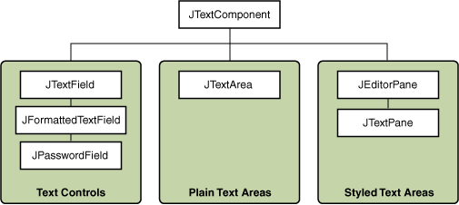
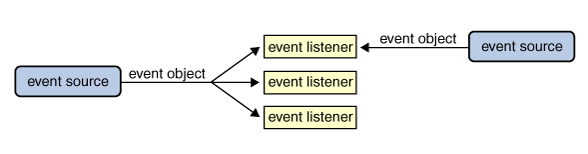

# Java Swing 源码分析

## Java 版本

Java 17

## Java Swing 文档

https://docs.oracle.com/javase/tutorial/uiswing/index.html

## Swing API 18个公共包

The Swing API is powerful, flexible — and immense. The Swing API has 18 public packages:

+ javax.accessibility	
+ javax.swing.plaf	
+ javax.swing.text
+ javax.swing	javax.swing.plaf.basic	
+ javax.swing.text.html
+ javax.swing.border	
+ javax.swing.plaf.metal	
+ javax.swing.text.html.parser
+ javax.swing.colorchooser	
+ javax.swing.plaf.multi	javax.swing.text.rtf
+ javax.swing.event	
+ javax.swing.plaf.synth	
+ javax.swing.tree
+ javax.swing.filechooser	
+ javax.swing.table	
+ javax.swing.undo

## java.awt.peer包下的XxxPeer

peer 同龄人；同辈；同等社会地位（或能力）的人

peer 对等设计模式


AWT Java 1.x 内置的库，使用的技术是对等设计模式 Peer

该设计模式将awt控件直接对应到运行平台上的一个类似或等同控件。例如Button类对应Windows的标准Button。

对等模式用于在两个控件间建立一个相互作用的关系。

AWT首先经过通用的Java技术来控制图形、事件等，然后Java虚拟机再将请求传送到具体的平台图形和控件接口去交互。

对等模式，SWT必须使用操作系统图形接口功能的交集，为了保证移植性，只能使用所有系统都支持的特性，所以AWT功能较少，图形难看，这是为了保证移植性而做出的牺牲。

Swing Java 1.2 

Swing一些底层类使用AWT的Component、Container、Window等类，可能是为了保持与AWT兼容，方便大家将代码移植到Swing上

Swing不再沿用Peer对等模式来实现GUI界面，完全基于Java自绘制图形实现。Swing界面和Windows界面不再有任何类似，尤其是窗口控件样式，但可以通过换肤来达到模拟Windows界面的效果。

Swing的结构庞大而且复杂，模式和结构会相对比较难理解，应为很多类会继承自AWT相关的类。

Swing控件都是利用Java图形功能绘制出来，而不是对应到平台的一个具体控件实现，所有Swing控件都是直接或间接用Graphics绘制出来，好处是，想要什么控件，直接绘制。这样做可以不牺牲移植性的基础上，加入丰富的界面交互功能。

缺点效率低。

1. Swing类层次太深，一个JFrame经过4、5层类继承关系，再加上虚拟机的图形功能内部实现，大概6曾转接关系；

    ```
    java.lang.Object
     java.awt.Component
      java.awt.Container
       java.awt.Window
        java.awt.Frame
         javax.swing.JFrame
    ```
   
2. Swing基于自绘制技术，为了保持可移植性，可能无法使用硬件加速和平台特性来加快图形操作的速度。Java是“高层”的图形技术，没有底层做图形速度快。

## Swing 使用拖拽的方式设计界面

可以把程序开发的重点放在逻辑处理上

## setVisible方法

setVisible方法并不会阻塞当前线程，
使用了其他线程来进行事件监听

## 调试注意点

需要有断点才能看到线程调用栈情况

## Swing 顶级容器 Top-Level Container

As we mentioned before, Swing provides three generally useful top-level container classes: JFrame, JDialog, and JApplet. When using these classes, you should keep these facts in mind:

+ To appear onscreen, every GUI component must be part of a containment hierarchy. A containment hierarchy is a tree of components that has a top-level container as its root. We'll show you one in a bit.
+ Each GUI component can be contained only once. If a component is already in a container and you try to add it to another container, the component will be removed from the first container and then added to the second.
+ Each top-level container has a content pane that, generally speaking, contains (directly or indirectly) the visible components in that top-level container's GUI.
+ You can optionally add a menu bar to a top-level container. The menu bar is by convention positioned within the top-level container, but outside the content pane. Some look and feels, such as the Mac OS look and feel, give you the option of placing the menu bar in another place more appropriate for the look and feel, such as at the top of the screen.

Note: Although JInternalFrame mimics JFrame, internal frames aren't actually top-level containers.

组件树结构非常重要


JFrame 的内容面板 Content Pane 继承 JComponent，使用 BorderLayout

JFrame的add remote setLayout方法会自动调用ContentPane的相应方法，为了方便用户使用。

```
Note: 
As a convenience, the add method and its variants, remove and setLayout have been overridden to forward to the contentPane as necessary. This means you can write

frame.add(child);
and the child will be added to the contentPane.

Note that only these three methods do this. This means that getLayout() will not return the layout set with setLayout().
```
## 布局管理器 Layout Manager

JFrame的Content Pane 默认 BorderLayout
JPanel 默认 FlowLayout

## 事件分发线程

AWT-EventQueue-0

## JFrame的add，其实是JFrame.contentPane的add

JFrame.add() -> Container.add() -> JFrame.addImpl()

```java
public class JFrame  extends Frame implements WindowConstants, Accessible, RootPaneContainer, TransferHandler.HasGetTransferHandler 
{
    // ...
    protected void addImpl(Component comp, Object constraints, int index)
    {
        if (isRootPaneCheckingEnabled()) {
            getContentPane().add(comp, constraints, index);
        }
        else {
            super.addImpl(comp, constraints, index);
        }
    }
}
    
```

## Swing Components 组件

Swing 所有以“J”开头的组件，除了顶级容器，都继承自 JComponent

JFrame和JDialog不是继承JComponent，因为他们要实现implement顶级容器

JComponent 继承 Container， Container 继承 Component

```
java.lang.Object
  java.awt.Component
    java.awt.Container
      javax.swing.JComponent
```

## 组件可见性

顶级容器组件默认不可见，其他组件默认可见

void setVisible(boolean)
boolean isVisible()

Set or get whether the component is visible. Components are initially visible, with the exception of top-level components.

## Text Components 文本组件

Swing 的文本组件都是继承自 JTextComponent



## Swing Component Examples

组件例子

https://docs.oracle.com/javase/tutorial/uiswing/examples/components/index.html

## JFrame ContentPane 

JFrame的ContentPane是JPanel，默认使用BorderLayout

constraints默认是BorderLayout.CENTER，也就是默认添加组件到中间区域

```java
public class JRootPane extends JComponent implements Accessible {
    protected Container createContentPane() {
        JComponent c = new JPanel();
        c.setName(this.getName()+".contentPane");
        c.setLayout(new BorderLayout() {
            /* This BorderLayout subclass maps a null constraint to CENTER.
             * Although the reference BorderLayout also does this, some VMs
             * throw an IllegalArgumentException.
             */
            public void addLayoutComponent(Component comp, Object constraints) {
                if (constraints == null) {
                    constraints = BorderLayout.CENTER;
                }
                super.addLayoutComponent(comp, constraints);
            }
        });
        return c;
    }
}
   
```

## JApplet

JApplet依赖浏览器来执行。

很多浏览器都可以支持JApplet，包括了IE，Firefox等。

Java 9 开始废弃

## Swing 按钮 Buttons

继承自 AbstractButton

JMenuItem也是一种按钮

|Class|Summary|
|---|---|
|JButton     	        |A common button.	|                 
|JCheckBox	            |A check box button.|	                         
|JRadioButton	        |One of a group of radio buttons.|	     
|JMenuItem	            |An item in a menu.	|
|JCheckBoxMenuItem	    |A menu item that has a check box.|	
|JRadioButtonMenuItem	|A menu item that has a radio button.|	
|JToggleButton	        |Implements toggle functionality inherited by JCheckBox and JRadioButton. Can be instantiated or subclassed to create two-state buttons.|


## JFrame 屏幕居中

frame.setLocationRelativeTo(null);

## Swing 线程

A Swing programmer deals with the following kinds of threads:

+ Initial threads, the threads that execute initial application code.
+ The event dispatch thread, where all event-handling code is executed. Most code that interacts with the Swing framework must also execute on this thread.
+ Worker threads, also known as background threads, where time-consuming background tasks are executed.

Why does not the initial thread simply create the GUI itself? Because almost all code that creates or interacts with Swing components must run on the event dispatch thread. This restriction is discussed further in the next section.

为什么不简单使用初始化线程开创建GUI，因为几乎所有创建和交互Swing组件的代码，必须运行在事件分发线程。

## Swing 组件 MVC

JTextComponent
+ A model, known as a document, that manages the component's content.
+ A view, which displays the component on screen.
+ A controller, known as an editor kit, that reads and writes text and implements editing capabilities with actions.

## Swing 事件

+ 事件源    一般是组件或模型
+ 事件      由事件源创建，是一个对象，由事件信息，可以识别出事件源
+ 事件监听器 监听、处理事件

Each event is represented by an object that gives information about the event and identifies the event source. Event sources are often components or models, but other kinds of objects can also be event sources.



EventObject 所有 AWT Swing事件的父类

事件分两类 
+ 低级事件 例如鼠标 键盘事件
+ 语义事件 例如Action Item事件

```
Concepts: Low-Level Events and Semantic Events
Events can be divided into two groups: low-level events and semantic events. Low-level events represent window-system occurrences or low-level input. Everything else is a semantic event.

Examples of low-level events include mouse and key events both of which result directly from user input. Examples of semantic events include action and item events. A semantic event might be triggered by user input; for example, a button customarily fires an action event when the user clicks it, and a text field fires an action event when the user presses Enter. However, some semantic events are not triggered by low-level events, at all. For example, a table-model event might be fired when a table model receives new data from a database.

Whenever possible, you should listen for semantic events rather than low-level events. That way, you can make your code as robust and portable as possible. For example, listening for action events on buttons, rather than mouse events, means that the button will react appropriately when the user tries to activate the button using a keyboard alternative or a look-and-feel-specific gesture. When dealing with a compound component such as a combo box, it is imperative that you stick to semantic events, since you have no reliable way of registering listeners on all the look-and-feel-specific components that might be used to form the compound component.
```

## 事件适配器 Event Adapters

某些Listener有多个方法，如果只想实现个别方法，可用适配器


